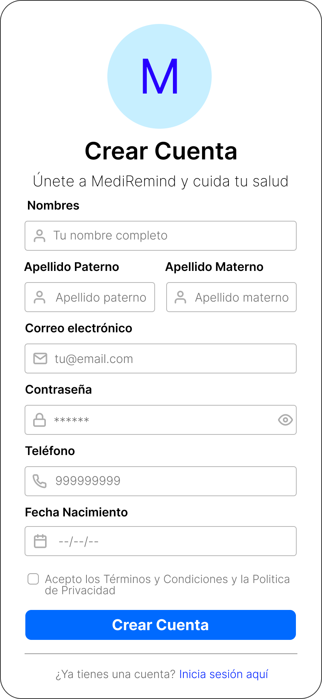

# Aplicación de Recordatorio de Medicamentos: MediRem

Repositorio del Grupo 3 para el proyecto final del curso Aplicaciones Móviles.

## Curso
Aplicaciones Móviles

## Docente
[Diego Fernando Baes Vasquez](https://github.com/diegobaesv)

## Prototipos UI
<table>
  <tr>
    <td align="center" width="25%">
      <b>Splash Screen</b> 
      
    </td>
    <td align="center" width="25%">
      <b>Intro</b> 
      
    </td>
    <td align="center" width="25%">
      <b>Onboarding #1</b> 
      
    </td>
    <td align="center" width="25%">
      <b>Onboarding #2</b> 
      
    </td>
  </tr>
  <tr>
    <td align="center" width="25%">
      <b>Onboarding #3</b> 
      
    </td>
    <td align="center" width="25%">
      <b>Login</b> 
      
    </td>
    <td align="center" width="25%">
      <b>Registro</b> 
      
    </td>
    <td align="center" width="25%">
      <b>Dashboard</b> 
      
    </td>
  </tr>
  <tr>
    <td align="center" width="25%">
      <b>Nuevo Recordatorio</b> 
      
    </td>
    <td align="center" width="25%">
      <b>Historial</b> 
      
    </td>
    <td align="center" width="25%">
      <b>Terminos y Condiciones</b> 
      
    </td>
    <td align="center" width="25%">
      <b>Configuración</b> 
      
    </td>
  </tr>
</table>

## Diagrama de BD

## API/Backend
- [RECORDATORIO_MED_API](https://github.com/pr1vi3t/RECORDATORIO_MED_API)

## Integrantes
- [Nícolas Savio Felix Flores](https://github.com/pr1vi3t)
- [Roberto Carlos Miranda Quiñonez](https://github.com/RCMirandaDev)
- [Homero Percy Quispe Coaquira](https://github.com/percyQC)
- [Jose Randy Rodrigo Choque](https://github.com/RandyRodrigo)
- [Jose Carlos Yon](https://github.com/2017310708)